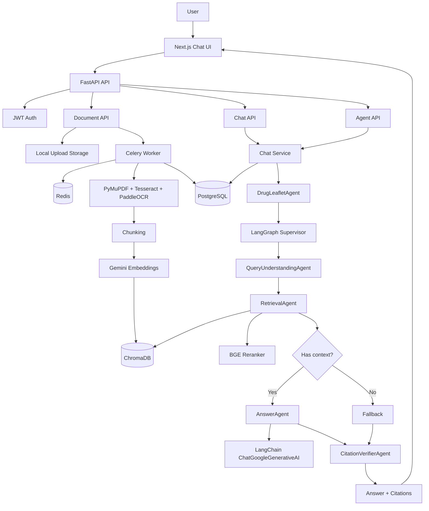

# Drug Leaflet RAG Agent

[](https://fastapi.tiangolo.com/)
[](https://nextjs.org/)
[](https://langchain-ai.github.io/langgraph/)
[](https://docs.docker.com/compose/)
[](#license)

Drug Leaflet RAG Agent is a full-stack, multi-user RAG application for asking grounded questions about medicine leaflets. Users upload PDF or image leaflets, the backend extracts text with OCR fallback, indexes chunks in ChromaDB, and answers questions through a LangGraph multi-agent workflow with source citations.

> **Medical safety notice**  
> This project is for educational and demonstration purposes only. Generated answers are not medical advice. Always consult a qualified clinician or pharmacist.

## Highlights

- **Real document ingestion**: PDF/image uploads, OCR fallback, chunking, embeddings, and vector indexing.
- **Multi-agent RAG workflow**: LangGraph supervisor with specialized query understanding, retrieval, answer, and citation verification agents.
- **Grounded chat**: streaming answers with citation markers and clickable source chunks.
- **Multi-user SaaS basics**: JWT auth, per-user document isolation, persistent chat sessions, and session deletion.
- **Async processing**: Celery + Redis pipeline for leaflet extraction and indexing.
- **Production-minded stack**: PostgreSQL, Alembic migrations, request logging, Docker Compose, and production-like Compose files.
- **Open-source friendly docs**: architecture notes, deployment guide, and reference-project alignment.

## Demo Flow

1. Register or log in.
2. Upload a medicine leaflet PDF, JPEG, PNG, or WebP.
3. Wait until processing reaches `completed / Ready / 100%`.
4. Ask a question such as: "What is the adult dose?"
5. Read the generated answer and open citation chips to inspect the source chunk.

## Architecture



## Tech Stack

| Layer | Technology |
|---|---|
| Frontend | Next.js App Router, TypeScript, Tailwind CSS |
| Backend | FastAPI, Python 3.11 |
| Agent/RAG | LangGraph, LangChain, Google Gemini |
| Database | PostgreSQL, SQLAlchemy, Alembic |
| Vector Store | ChromaDB |
| Queue | Redis, Celery |
| OCR/Parsing | PyMuPDF, Tesseract, PaddleOCR, Pillow |
| Reranking | BGE reranker via FlagEmbedding |
| Deployment | Docker Compose |

## Repository Structure

```text
.
├── backend/
│   ├── app/
│   │   ├── agent/          # DrugLeafletAgent and specialized LangGraph agent nodes
│   │   ├── api/            # FastAPI routers and dependencies
│   │   ├── core/           # settings, database, security, logging
│   │   ├── models/         # SQLAlchemy models
│   │   ├── schemas/        # Pydantic schemas
│   │   ├── services/       # OCR, retrieval, vector store, LLM, chat services
│   │   └── tasks/          # Celery workers
│   └── alembic/            # database migrations
├── frontend/
│   ├── app/                # Next.js pages
│   └── lib/                # frontend API client and helpers
├── docs/                   # architecture/comparison notes
├── DEPLOYMENT.md
├── docker-compose.yml
└── docker-compose.prod.yml
```

## Quick Start

### Prerequisites

- Docker Desktop
- Google AI Studio API key: <https://aistudio.google.com/app/apikey>

### 1. Configure Environment

```bash
cp .env.example .env
```

Set at least:

```env
GOOGLE_API_KEY=your_google_ai_studio_key
JWT_SECRET_KEY=replace_with_a_long_random_secret
```

Generate a strong JWT secret:

```bash
python -c "import secrets; print(secrets.token_urlsafe(64))"
```

### 2. Start Services

```bash
docker compose up --build
```

### 3. Run Migrations

```bash
docker compose exec backend alembic upgrade head
```

### 4. Open the App

- Frontend: <http://localhost:3000>
- Dashboard: <http://localhost:3000/dashboard>
- API docs: <http://localhost:8000/docs>
- ChromaDB: <http://localhost:8001>

## Configuration

Important environment variables:

| Variable | Purpose |
|---|---|
| `GOOGLE_API_KEY` | Gemini LLM and embedding access |
| `JWT_SECRET_KEY` | JWT signing secret |
| `DATABASE_URL` | PostgreSQL connection string |
| `REDIS_URL` | Redis connection string |
| `CHROMA_HOST` / `CHROMA_PORT` | ChromaDB host/port |
| `UPLOAD_DIR` | Uploaded leaflet storage path |
| `RERANKER_ENABLED` | Enable/disable local BGE reranking |
| `NEXT_PUBLIC_API_URL` | Frontend API base URL |

See [.env.example](.env.example) for the full list.

## API Overview

Authentication:

- `POST /api/v1/auth/register`
- `POST /api/v1/auth/login`
- `GET /api/v1/auth/me`

Documents:

- `POST /api/v1/documents`
- `GET /api/v1/documents`
- `GET /api/v1/documents/{document_id}`
- `GET /api/v1/documents/{document_id}/pages`
- `GET /api/v1/documents/{document_id}/chunks`
- `POST /api/v1/documents/{document_id}/process`
- `DELETE /api/v1/documents/{document_id}`

Chat and agent:

- `POST /api/v1/chat`
- `POST /api/v1/chat/stream`
- `GET /api/v1/chat/sessions`
- `GET /api/v1/chat/sessions/{session_id}`
- `DELETE /api/v1/chat/sessions/{session_id}`
- `POST /api/v1/agent/run`

Retrieval/debug:

- `POST /api/v1/retrieval/query`

Health:

- `GET /api/v1/health`
- `GET /api/v1/health/db`

## LangGraph Agent Workflow

The main RAG workflow lives in `backend/app/services/rag_graph.py` and is exposed through `DrugLeafletAgent`.

```text
START
  -> QueryUnderstandingAgent
  -> RetrievalAgent
  -> has_context?
      -> AnswerAgent
      -> Fallback
  -> CitationVerifierAgent
  -> END
```

Current specialized agents:

- `QueryUnderstandingAgent`: lightweight intent detection for dosage, side effects, contraindications, interactions, storage, pregnancy/lactation, and general questions.
- `RetrievalAgent`: builds citation-ready context with ChromaDB and optional BGE reranking.
- `AnswerAgent`: calls LangChain Gemini to generate grounded answers or safe fallback responses.
- `CitationVerifierAgent`: checks whether generated answers include bracketed citation markers.

## Verification

If you include the local test folders, the project can be checked with:

```bash
docker compose exec backend pytest -q
docker compose run --rm --no-deps frontend npm test
docker compose run --rm --no-deps frontend npm run typecheck
docker compose run --rm --no-deps frontend npm run build
```

## Evaluation

A lightweight RAG evaluation was run on a real public Paracetamol leaflet:

- 10 real QA cases
- 0 runtime errors
- 100% citation presence
- 90% citation marker rate
- 4.3s average latency
- 87.5% average context term hit rate
- 90% average answer term hit rate

Known issue from evaluation: the local BGE reranker can fall back to vector order because of a tokenizer compatibility error in the current environment.

## Deployment

For production-like local deployment:

```bash
docker compose -f docker-compose.prod.yml --env-file .env up --build -d
docker compose -f docker-compose.prod.yml --env-file .env exec backend alembic upgrade head
```

See [DEPLOYMENT.md](DEPLOYMENT.md) for deployment notes.

## Roadmap

- Add GitHub Actions CI for backend and frontend checks.
- Add browser E2E tests for upload, chat, and citation opening.
- Fix or pin the BGE reranker tokenizer compatibility issue.
- Add optional object storage support for uploaded files.
- Add observability dashboards and structured tracing for the RAG workflow.
- Add hosted demo screenshots or a short demo video.

## Security Notes

- Never commit `.env`.
- Rotate `GOOGLE_API_KEY` and `JWT_SECRET_KEY` before public demos or deployment.
- Do not expose PostgreSQL, Redis, or ChromaDB directly to the public internet.
- This application does not replace medical professionals or official prescribing information.

## Contributing

Issues and pull requests are welcome. For larger changes, please open an issue first to discuss the proposed direction.

## License

MIT
